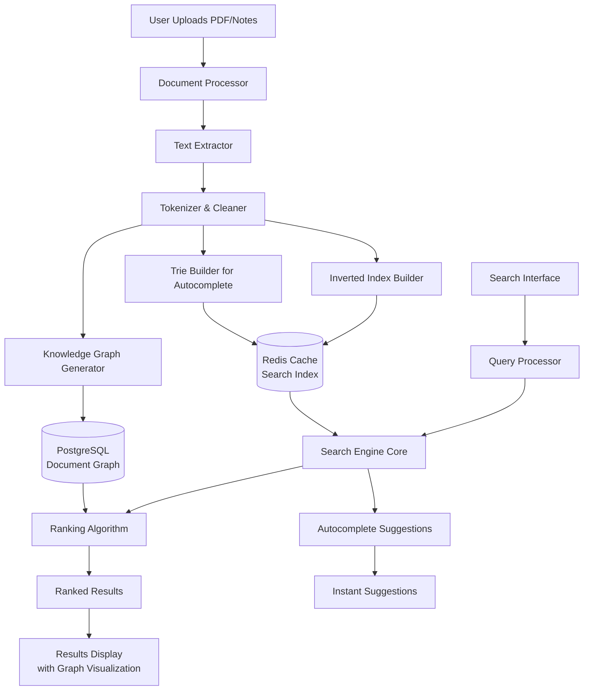

# Lore
### Personal Search Engine

Lore is a personal search engine that indexes and searches through your notes, PDFs and documents with
intelligent ranking. Unlike traditional file search, it builds an internal knowledge graph of your content,
understands semantic connections between documents and ranks results based on both keyword relevance and
document relationships. It's like having your own personal Google for everything you've studied or written.

## Objectives

To create an intelligent search interface that indexes PDFs and text documents with real-time processing
- To implement inverted indexing and Trie data structures for efficient text searching
- To develop a ranking algorithm that considers both keyword frequency and semantic document
relationships
- To build a knowledge graph visualization showing how documents connect through shared concepts
- To practice implementing core DSA concepts (graphs, tries, ranking algorithms) in a practical web
application

## Project Scope

The system will process uploaded PDFs and text files, extract their content and build searchable indexes. Users
can search through all documents with instant results ranked by relevance. Advanced features include document
similarity detection, concept tagging, and a visual knowledge graph. The system will support common
document formats (PDF, TXT, DOCX, image) and handle up to 100 documents in its initial version with
scalable architecture for future expansion.

## Tools and Technologies

- Frontend: React.js with D3.js for graph visualization, Tailwind CSS
- Backend: Django with Django REST Framework
- Database: PostgreSQL for metadata, Redis for caching indexes
- Search Engine: Custom implementation using inverted index and Trie
- File Processing: PyPDF2, python-docx for text extraction
- Deployment: Docker containerization

## System Architecture

## Modules

| Module Name         | Description                                                                   | DSA Concepts Used                     |
|---------------------|-------------------------------------------------------------------------------|---------------------------------------|
| Document Indexer    | Processes uploaded documents, extracts text, builds search indexes            | Inverted Index, Hash Tables           |
| Search Engine Core  | Executes search queries with boolean operators                                | Trie, Postings Lists                  |
| Ranking System      | Ranks results using TF-IDF and document relationship scoring                  | Graph Algorithms, Priority Queues     |
| Knowledge Graph     | Creates and visualizes connections between documents based on shared concepts | Graph Theory, BFS/DFS                 |
| Autocomplete        | Provides real-time search suggestions as user types                           | Trie, Prefix Matching                 |
| Document Similarity | Finds similar documents and suggests "related reads"                          | Cosine Similarity, Vector Space Model |

## Expected Output

A fully functional web application where users can:
- Upload documents (PDFs, notes) which are automatically indexed
- Search across all documents with sub-second response time
- See ranked search results
- Visualize document relationships in an interactive knowledge graph
- Get intelligent suggestions for related documents and concepts
- Export search results and document analytics

The system will demonstrate measurable performance: indexing 100 pages in under 10 seconds, returning search results in <200ms, and accurately ranking documents by relevance.

